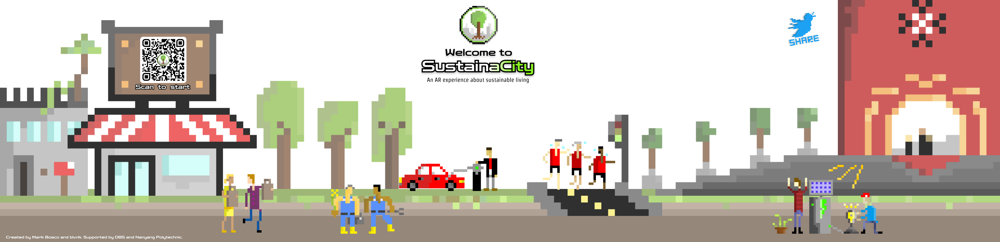
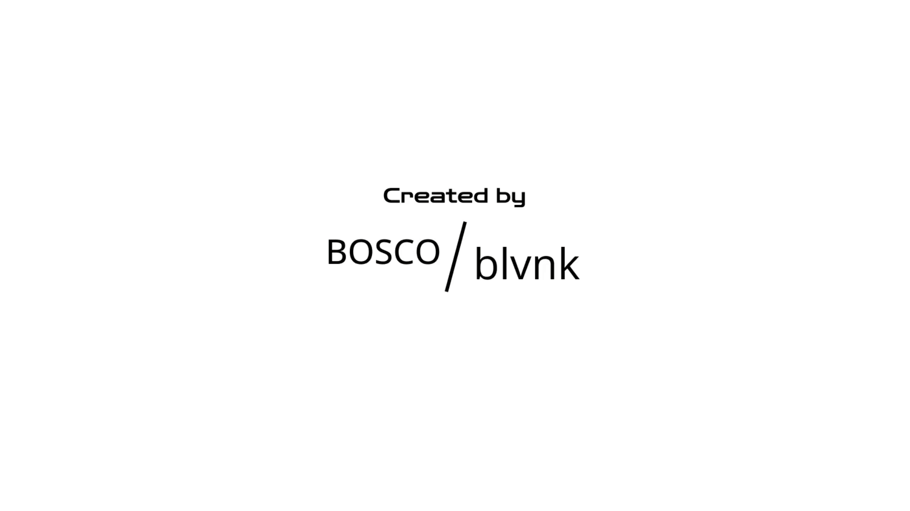

<div align="center">
     <!-- Logo -->
    <h1>Sustainacity</h1> <!-- Title -->
    <p>
      AR (Augmented Reality) enhanced web app to showcase DBS' sustainability initiative.
    </p> <!-- Description -->
    <p>
      Built With: <a href="https://aframe.io">A-Frame</a> • <a href="https://hiukim.github.io/mind-ar-js-doc">MindAR</a>
    </p> <!-- Built With -->
</div>

---

## About

AR (Augmented Reality) enhanced web app to showcase DBS' sustainability initiative. Created for NYP x DBS AR Storytelling Sustainability competition. Hosted at [adoreblvnk.github.io/sustainacity](https://adoreblvnk.github.io/sustainacity).

**Poster**



Scan the poster (& the hidden objects inside it) to get started.

prod by blvnk & [Mark Bosco](https://github.com/MarkB-NYP).

## Demo

**Home**



**Scenes**


The whereabouts of the exact location on the poster for each scene is left for you to find out, although they can be found inside this repository under `assets/detect/`.

## Getting Started

## Execution

This project is hosted on Github, but can be locally run with Python as the web server:

```sh
python3 -m http.server
```

## License

This project is licensed under the terms of the MIT license.

## Credits

- [blvnk](https://github.com/adoreblvnk)
- [Mark Bosco](https://github.com/MarkB-NYP)
